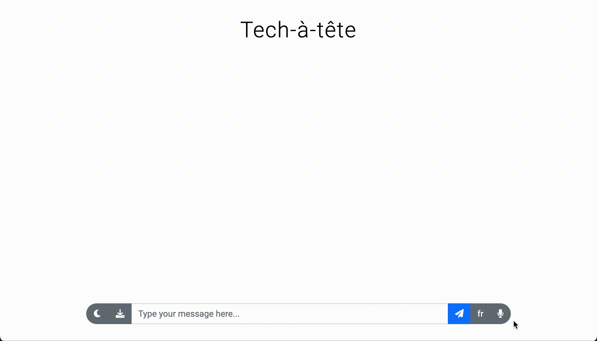

  

# Companion: Generative-AI-Powered Foreign-Language Private Tutor

---
## 🗺️ Roadmap: 
- **Improved session experience:**
  - [x] ~Tutor kicks-off sessions~
  - [x] ~Improving tutor responses~
  - [x] ~Save and load sessions~
  - [ ] Improved error handling

- **Fully-functioning web application:**
  - [ ] Move configurations from YML file to a web-apge _(in progress)_
  - [ ] Allow launching on Streamlit cloud
    - [x] ~Allow authenticating to Google Cloud Services using Service Account~
  - [ ] Documentation website
---

Companion uses [OpenAI ChatGPT](https://chat.openai.com) & [Whisper](https://openai.com/research/whisper) and 
[Google Text-to-Speech](https://cloud.google.com/text-to-speech) & 
[Translate](https://translate.google.com/) to create your own personal
private tutor for learning a new foreign language. You can write, talk, read and listen 
in both your native language and selected foreign language. It's also configured to correct any mistakes you make.

Companion is distributed free of charge for any non-commercial usage. Note that the different APIs
and services used are not necessarily free, and might charge you based on your usage. 

## Supported languages
Note performance might vary between different languages.

### Input languages
Languages supported by [OpenAI Whisper](https://help.openai.com/en/articles/7031512-whisper-api-faq):

> Afrikaans, Arabic, Armenian, Azerbaijani, Belarusian, Bosnian, Bulgarian, Catalan, Chinese, Croatian, Czech, Danish, Dutch, English, Estonian, Finnish, French, Galician, German, Greek, Hebrew, Hindi, Hungarian, Icelandic, Indonesian, Italian, Japanese, Kannada, Kazakh, Korean, Latvian, Lithuanian, Macedonian, Malay, Marathi, Maori, Nepali, Norwegian, Persian, Polish, Portuguese, Romanian, Russian, Serbian, Slovak, Slovenian, Spanish, Swahili, Swedish, Tagalog, Tamil, Thai, Turkish, Ukrainian, Urdu, Vietnamese, Welsh.

### Output languages
Languages supported by [Google Text-to-Speech](https://cloud.google.com/text-to-speech/docs/voices):

> Afrikaans (South Africa), Arabic, Basque (Spain), Bengali (India), Bulgarian (Bulgaria), Catalan (Spain), Chinese (Hong Kong), Czech (Czech Republic), Danish (Denmark), Dutch (Belgium), Dutch (Netherlands), English (Australia), English (India), English (UK), English (US), Filipino (Philippines), Finnish (Finland), French (Canada), French (France), Galician (Spain), German (Germany), Greek (Greece), Gujarati (India), Hebrew (Israel), Hindi (India), Hungarian (Hungary), Icelandic (Iceland), Indonesian (Indonesia), Italian (Italy), Japanese (Japan), Kannada (India), Korean (South Korea), Latvian (Latvia), Lithuanian (Lithuania), Malay (Malaysia), Malayalam (India), Mandarin Chinese, Marathi (India), Norwegian (Norway), Polish (Poland), Portuguese (Brazil), Portuguese (Portugal), Punjabi (India), Romanian (Romania), Russian (Russia), Serbian (Cyrillic), Slovak (Slovakia), Spanish (Spain), Spanish (US), Swedish (Sweden), Tamil (India), Telugu (India), Thai (Thailand), Turkish (Turkey), Ukrainian (Ukraine), Vietnamese (Vietnam)

## Documentation
* [Setting up required services](/markdown/setting_up.md)
* [Installation & configuration](/markdown/install.md)
* [Running & using](/markdown/run.md)

---

[Companion Licences](/markdown/licenses.md)