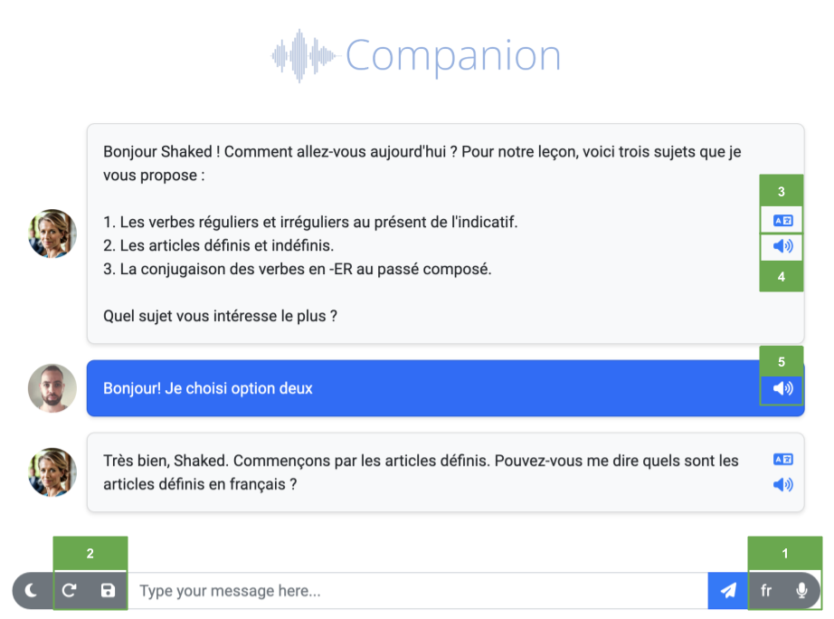

# Using Companion

## Launching
From the `companion` directory in your terminal, run:
```bash
python companion.py
```
You may also add:
```
-c CONFIG_FILE  select an alternative configuration file
-k KEYS_FILE    select a keys file
```
Both options are optional.

To begin, go to **[127.0.0.1:5000](http://127.0.0.1:5000)** in your browser. 
**Note**: Refreshing the page will restart the chat. 

!!! info "Launching for the first time"
    If this is the first time you run the app, you'll need to first configure your tutor. To do so, 
    click Settings
    () 
    on the top-left corner of the main screen, or go to **[127.0.0.1:5000/setup](http://127.0.0.1:5000/setup)**.


## User Interface




The UI should be quite straightforward, and resemble a standard chat. Here are some additional 
useful functionalities available:

1. **Recording**: You are able to write to your tutor text messages, but you can also talk. Click the 
recording button to begin recording (it will turn red), and once again to stop recording and process it.
The language button next to the recording button indicates the language you speak in the recording. Click it to
switch between your native language and the one you learn. There's also automatic language recognition option
(marked by 'A'), but it is less recommended, as processing might take longer and might be more prone to errors.
_You can use Alt+R to turn recording on and off, and Alt+L to switch languages._
2. **Save & load session**: You can save your current session, and easily load it next time you launch the app
3. **Translate**: Clicking this button will add translation to your tutor messages in your selected native language.
4. **Tutor reciting**: Clicking this button will play the tutor reciting the text. You can also ask it to recite
you messages, to hear how it pronounces it.
5. **User recording**: If your message is based on recording, clicking this button will play your recording.
