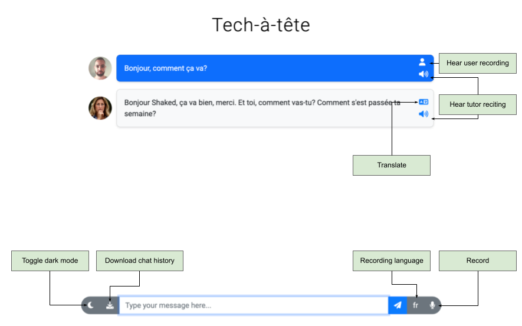

# Running
1. From the `companion` directory in your terminal, run:
```bash
python companion.py
```
This will look by default for the `config.yml` file. If you wth to set an alternative configuration file, run:
```bash
python companion.py -c CONFIG_FILE
```

2. Go to [127.0.0.1:5000](http://127.0.0.1:5000) in your browser.
If this is the first time you run the app (or you'd like to change its configurations), 
go to [127.0.0.1:5000/setup](http://127.0.0.1:5000/setup). The app must be restarted
after setup for changes to take effect.

**Note**: Refreshing the page will restart the chat.


# User Interface




The UI should be quite straightforward, and resemble a standard chat. Here are some additional 
useful functionalities available:

* **Recording**: You are able to write to your tutor text messages, but you can also talk. Click the 
recording button to begin recording (it will turn red), and once again to stop recording and process it.
The language button next to the recording button indicates the language you speak in the recording. Click it to
switch between your native language and the one you learn. There's also automatic language recognition option
(marked by 'A'), but it is less recommended, as processing might take longer and might be more prone to errors.
_You can use Alt+R to turn recording on and off, and Alt+L to switch languages._
* **Download chat history**: Will be saved as a JSON file.
* **Bot reciting**: Clicking this button will play the bot reciting the text. You can also ask it to recite
you messages, to hear how it pronounces it.
* **User recording**: If your message is based on recording, clicking this button will play your recording.
* **Translate**: Clicking this button will add translation to your tutor messages in your selected native language.
